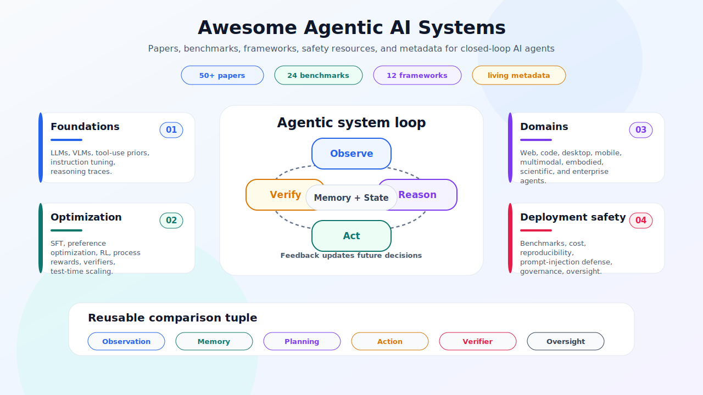
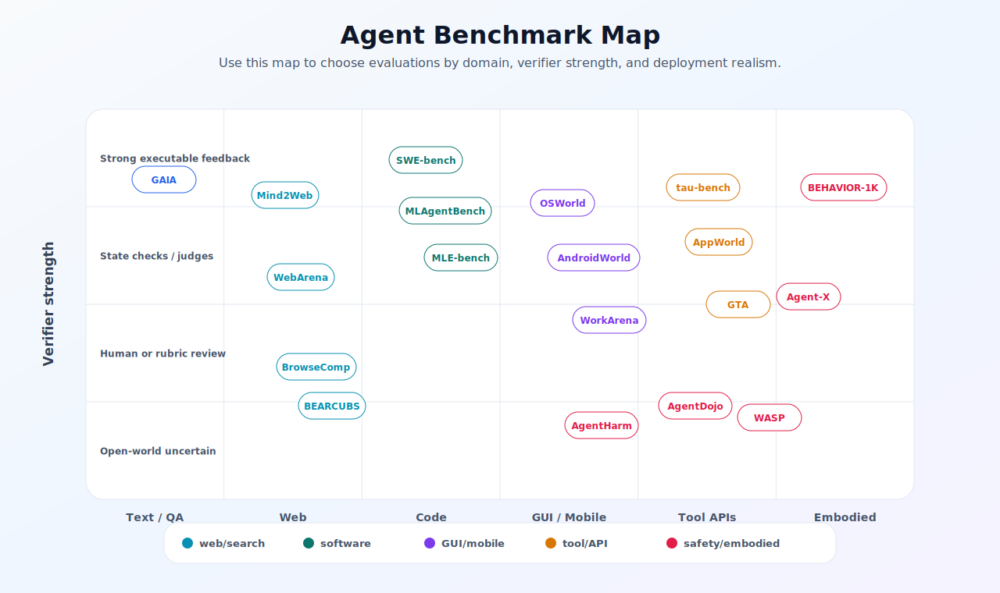
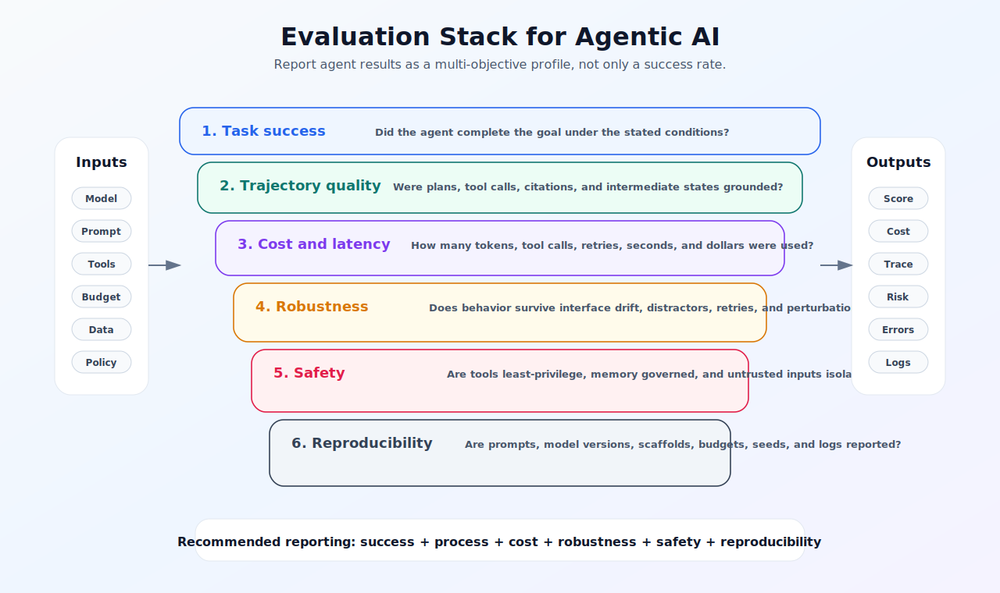

<!-- markdownlint-disable MD013 -->

<div align="center">

# Awesome Agentic AI Systems

A curated, research-oriented map of agentic AI papers, benchmarks, frameworks, safety resources, and reproducibility checklists.

[](https://awesome.re)
[](LICENSE)
[](#updates)
[](CONTRIBUTING.md)
[](#how-to-use-this-repository)



</div>

---

## Scope

This repository accompanies the survey **From Models to Agents: A Systems Survey of Agentic AI**. It is designed as a living index for researchers who study systems that do more than generate a single response: they observe, reason, plan, call tools, interact with environments, verify intermediate results, update memory, and operate under oversight.

The collection focuses on agentic AI systems built around large language models, large multimodal models, tool-using models, computer-use agents, web agents, software engineering agents, scientific agents, embodied agents, multi-agent systems, safety evaluation, and deployment governance.

This is not only a paper list. It is a structured map for comparing agentic systems by observation space, action interface, memory, planning strategy, verifier strength, benchmark realism, cost, safety, and human oversight.

---

## How to use this repository

| User goal | Start here | Then read |
|---|---|---|
| New to agentic AI | [Core reading path](#core-reading-path) | [Foundations and methods](#foundations-and-methods) |
| Writing a survey | [Research landscape matrix](#research-landscape-matrix) | [Benchmark matrix](#benchmark-and-evaluation-matrix) and [Open problems](#open-problems) |
| Building an agent | [Frameworks and infrastructure](#frameworks-and-infrastructure) | [Safety checklist](#deployment-safety-checklist) |
| Benchmarking agents | [Benchmark matrix](#benchmark-and-evaluation-matrix) | [Reproducibility checklist](#reproducibility-checklist) |
| Studying safety | [Safety and security resources](#safety-security-and-governance) | [Deployment safety checklist](#deployment-safety-checklist) |
| Contributing | [Contribution guide](CONTRIBUTING.md) | [Issue template](.github/ISSUE_TEMPLATE/add-paper.yml) |

---

## Contents

- [Core reading path](#core-reading-path)
- [Research landscape matrix](#research-landscape-matrix)
- [Surveys](#surveys)
- [Foundations and methods](#foundations-and-methods)
- [Application domains](#application-domains)
- [Benchmark and evaluation matrix](#benchmark-and-evaluation-matrix)
- [Safety, security, and governance](#safety-security-and-governance)
- [Frameworks and infrastructure](#frameworks-and-infrastructure)
- [Datasets and structured metadata](#datasets-and-structured-metadata)
- [Reproducibility checklist](#reproducibility-checklist)
- [Open problems](#open-problems)
- [Contribution policy](#contribution-policy)
- [Citation](#citation)

---

## Core reading path

A minimal route through the field is below. It starts from reasoning-and-acting, then moves to tools, memory, web interaction, coding, computer use, multimodality, embodied action, evaluation, and safety.

| Order | Work | Why it matters | Links |
|---:|---|---|---|
| 1 | ReAct | Introduces interleaved reasoning and acting as a practical agent loop. | [arXiv](https://arxiv.org/abs/2210.03629) |
| 2 | Toolformer | Shows how language models can learn when and how to call tools. | [arXiv](https://arxiv.org/abs/2302.04761) |
| 3 | WebGPT | Early browser-assisted QA with citations and human feedback. | [arXiv](https://arxiv.org/abs/2112.09332) |
| 4 | Reflexion | Uses verbal feedback and episodic memory for trial-level improvement. | [arXiv](https://arxiv.org/abs/2303.11366) |
| 5 | Voyager | Demonstrates open-ended skill acquisition with an executable skill library. | [arXiv](https://arxiv.org/abs/2305.16291) |
| 6 | WebArena | Realistic self-hosted web environment for autonomous agents. | [arXiv](https://arxiv.org/abs/2307.13854) |
| 7 | SWE-bench | Real GitHub issue resolution benchmark for coding agents. | [arXiv](https://arxiv.org/abs/2310.06770) |
| 8 | GAIA | General assistant benchmark requiring reasoning, browsing, tools, and multimodality. | [arXiv](https://arxiv.org/abs/2311.12983) |
| 9 | OSWorld | Real computer environment for multimodal desktop agents. | [arXiv](https://arxiv.org/abs/2404.07972) |
| 10 | tau-bench | Tool-agent-user interaction with domain rules and reliability over multiple trials. | [arXiv](https://arxiv.org/abs/2406.12045) |
| 11 | AgentDojo | Dynamic prompt-injection benchmark for tool-using agents over untrusted data. | [arXiv](https://arxiv.org/abs/2406.13352) |
| 12 | Mind2Web 2 | Long-horizon agentic search with agent-as-a-judge evaluation. | [arXiv](https://arxiv.org/abs/2506.21506) |

---

## Research landscape matrix



| Dimension | Web/search agents | Coding agents | Computer-use agents | Multimodal agents | Embodied agents | Scientific/enterprise agents |
|---|---|---|---|---|---|---|
| Observation | Pages, DOM, search results, citations | Repositories, issues, tests, logs | Screenshots, accessibility trees, desktop state | Images, video, charts, documents, screenshots | Sensors, language, spatial state, proprioception | Private corpora, dashboards, workflows, databases |
| Action space | Search, click, browse, cite, summarize | Edit, test, debug, patch, inspect | Click, type, scroll, manage files, switch windows | Ground, extract, crop, zoom, call tools | Navigate, manipulate, invoke low-level policies | Retrieve, analyze, write, call APIs, escalate |
| Strong verifier | Citation checks, task success, human review | Unit tests, builds, static analysis | Environment instrumentation, human evaluation | Task-specific judges, visual checkers | Rewards, safety monitors, task completion | Domain experts, process logs, policy rules |
| Key bottleneck | Evidence management and adversarial content | Repository-scale state and secure execution | Pixel-to-action grounding | Uncertainty-aware perception-control integration | Sim-to-real and irreversible actions | Privacy, provenance, compliance, delegation |
| Representative benchmarks | WebArena, Mind2Web, BrowseComp, BEARCUBS | SWE-bench, SWE-agent, HumanEvalFix | OSWorld, AndroidWorld, WorkArena | GTA, Agent-X, MMMU, VisualWebArena | ALFWorld, Habitat, BEHAVIOR-1K | MLE-bench, MLAgentBench, ScienceAgentBench, tau-bench |

---

## Surveys

| Year | Survey | Main focus | Links |
|---:|---|---|---|
| 2023 | A Survey on Large Language Model based Autonomous Agents | Construction, applications, evaluation of LLM-based autonomous agents. | [arXiv](https://arxiv.org/abs/2308.11432) |
| 2023 | The Rise and Potential of Large Language Model Based Agents | General LLM agents, societies, construction frameworks. | [arXiv](https://arxiv.org/abs/2309.07864) |
| 2024 | Large Language Model based Multi-Agents | Multi-agent progress, communication, profiling, cooperation. | [arXiv](https://arxiv.org/abs/2402.01680) |
| 2024 | Large Multimodal Agents: A Survey | Multimodal agent components, applications, evaluation. | [arXiv](https://arxiv.org/abs/2402.15116) |
| 2024 | A Survey on LLM-based Multi-Agent System | Recent advances in LLM-based multi-agent systems. | [arXiv](https://arxiv.org/abs/2412.17481) |
| 2025 | Agents for Computer Use: A Comprehensive Survey | Desktop, browser, mobile, and OS-level agents. | [arXiv](https://arxiv.org/abs/2501.16150) |
| 2025 | Survey on Evaluation of LLM-based Agents | Evaluation methods, benchmark families, gaps. | [arXiv](https://arxiv.org/abs/2503.16416) |
| 2025 | Large Language Model Agent: A Survey on Methodology, Applications and Challenges | Agent methodology, collaboration, evolution, evaluation, applications. | [Hugging Face](https://huggingface.co/papers/2503.21460) |
| 2025 | Evaluation and Benchmarking of LLM Agents: A Survey | Agent behavior, capability, reliability, safety, enterprise evaluation. | [arXiv](https://arxiv.org/abs/2507.21504) |
| 2025 | Agentic AI: A Comprehensive Survey of Architectures, Applications, and Future Directions | Agentic architectures and applications. | [arXiv](https://arxiv.org/abs/2510.25445) |
| 2025 | A Survey on Agentic Multimodal Large Language Models | Agentic MLLMs, tool invocation, environment interaction, datasets, and applications. | [arXiv](https://arxiv.org/abs/2510.10991) |
| 2025 | AI Agentic Programming: A Survey of Techniques, Challenges, and Opportunities | Software-development agents, planning, memory, tool use, and evaluation. | [arXiv](https://arxiv.org/abs/2508.11126) |
| 2025 | Toward Edge General Intelligence with Agentic AI and Agentification | Edge agentic AI, agentification, compact models, and distributed deployment. | [arXiv](https://arxiv.org/abs/2508.18725) |

---

## Foundations and methods

### Reasoning, acting, tools, and memory

| Year | Work | Contribution | Tags | Links |
|---:|---|---|---|---|
| 2021 | WebGPT | Browser-assisted QA with references and preference optimization. | web, citations, human feedback | [arXiv](https://arxiv.org/abs/2112.09332) |
| 2022 | SayCan | Grounds language planning in robotic affordances. | embodied, planning, grounding | [arXiv](https://arxiv.org/abs/2204.01691) |
| 2022 | ReAct | Interleaves reasoning traces and environment actions. | planning, tools, interpretability | [arXiv](https://arxiv.org/abs/2210.03629) |
| 2023 | Toolformer | Self-supervised learning to call external APIs. | tools, APIs, self-supervision | [arXiv](https://arxiv.org/abs/2302.04761) |
| 2023 | PaLM-E | Embodied multimodal language model for robotics and VQA. | embodied, multimodal | [arXiv](https://arxiv.org/abs/2303.03378) |
| 2023 | Visual ChatGPT | Connects an LLM controller with visual foundation models. | multimodal, tools | [arXiv](https://arxiv.org/abs/2303.04671) |
| 2023 | ViperGPT | Uses generated Python programs to compose visual modules. | programmatic reasoning, vision | [arXiv](https://arxiv.org/abs/2303.08128) |
| 2023 | Reflexion | Improves agents through verbal reinforcement and episodic memory. | memory, self-improvement | [arXiv](https://arxiv.org/abs/2303.11366) |
| 2023 | HuggingGPT | Uses an LLM controller to plan, select, and execute expert models. | orchestration, model routing | [arXiv](https://arxiv.org/abs/2303.17580) |
| 2023 | Voyager | Lifelong Minecraft agent with curriculum and skill library. | skill library, embodied, self-improvement | [arXiv](https://arxiv.org/abs/2305.16291) |
| 2023 | RT-2 | Vision-language-action model transferring web knowledge to robot control. | VLA, robotics | [arXiv](https://arxiv.org/abs/2307.15818) |
| 2024 | SWE-agent | Agent-computer interfaces for software engineering agents. | coding, interface design | [arXiv](https://arxiv.org/abs/2405.15793) |

### Multi-agent systems

| Year | Work | Contribution | Links |
|---:|---|---|---|
| 2023 | CAMEL | Role-playing communicative agents for studying cooperation. | [arXiv](https://arxiv.org/abs/2303.17760) |
| 2023 | ChatDev | Multi-agent software development via communicative dehallucination. | [arXiv](https://arxiv.org/abs/2307.07924) |
| 2023 | MetaGPT | Encodes SOP-style workflows into multi-agent collaboration. | [arXiv](https://arxiv.org/abs/2308.00352) |
| 2023 | AutoGen | Multi-agent conversation framework with LLMs, humans, and tools. | [arXiv](https://arxiv.org/abs/2308.08155) |

---

## Application domains

| Domain | Representative works | What to track |
|---|---|---|
| Web and agentic search | WebGPT, ReAct, Mind2Web, WebArena, BrowseComp, BEARCUBS, Mind2Web 2 | Evidence collection, source attribution, adversarial content, live-web drift |
| Software engineering | SWE-bench, SWE-agent, OpenHands, MLAgentBench | Repository state, tests, patch correctness, secure execution |
| Computer use and GUI | OSWorld, AndroidWorld, WorkArena, VisualWebArena | Pixel grounding, accessibility-tree grounding, multi-window state |
| Multimodal and document agents | ViperGPT, Visual ChatGPT, GTA, Agent-X | Tool selection, visual uncertainty, chart/table/document grounding |
| Embodied agents | SayCan, PaLM-E, RT-2, Voyager, BEHAVIOR-1K | Affordances, sim-to-real, physical safety, long-horizon manipulation |
| Enterprise and scientific agents | tau-bench, AppWorld, MLE-bench, ScienceAgentBench, WorkArena++ | Policy compliance, provenance, private data, expert oversight |

---

## Benchmark and evaluation matrix



| Year | Benchmark | Domain | Size / scope | Strongest feedback | Links |
|---:|---|---|---|---|---|
| 2023 | Mind2Web | Web navigation | 2,000+ tasks, 137 websites, 31 domains | Action sequence / element grounding | [arXiv](https://arxiv.org/abs/2306.06070), [Project](https://osu-nlp-group.github.io/Mind2Web/) |
| 2023 | WebArena | Web agents | Self-hosted realistic websites across common domains | Functional task success | [arXiv](https://arxiv.org/abs/2307.13854), [Code](https://github.com/web-arena-x/webarena) |
| 2023 | AgentBench | General LLM agents | 8 interactive environments | Environment-level task success | [arXiv](https://arxiv.org/abs/2308.03688) |
| 2023 | SWE-bench | Software engineering | 2,294 real GitHub issues from 12 Python repositories | Tests and issue resolution | [arXiv](https://arxiv.org/abs/2310.06770), [Code](https://github.com/swe-bench/SWE-bench) |
| 2023 | MLAgentBench | ML experimentation | 13 end-to-end ML tasks | Experiment result / code execution | [arXiv](https://arxiv.org/abs/2310.03302), [Code](https://github.com/snap-stanford/MLAgentBench) |
| 2023 | GAIA | General AI assistants | 466 real-world questions | Exact answer plus tool/browser use | [arXiv](https://arxiv.org/abs/2311.12983) |
| 2024 | AgentBoard | Multi-turn LLM agents | Analytical evaluation board | Progress rate and fine-grained metrics | [arXiv](https://arxiv.org/abs/2401.13178), [Project](https://hkust-nlp.github.io/agentboard/) |
| 2024 | WorkArena | Enterprise web agents | ServiceNow knowledge-work tasks | Browser task completion | [arXiv](https://arxiv.org/abs/2403.07718), [Project](https://servicenow.github.io/WorkArena/) |
| 2024 | BEHAVIOR-1K | Embodied AI | 1,000 activities, 50 scenes, 9,000+ objects | Simulation rewards / task completion | [arXiv](https://arxiv.org/abs/2403.09227), [Project](https://behavior.stanford.edu/) |
| 2024 | OSWorld | Computer-use agents | 369 desktop/web tasks across OS environments | Execution-based evaluation | [arXiv](https://arxiv.org/abs/2404.07972), [Project](https://os-world.github.io/) |
| 2024 | AndroidWorld | Mobile agents | 116 programmatic tasks across 20 Android apps | System-state checks | [arXiv](https://arxiv.org/abs/2405.14573), [Project](https://google-research.github.io/android_world/) |
| 2024 | tau-bench | Tool-agent-user interaction | Simulated users, tools, domain rules | Database-state comparison, pass@k | [arXiv](https://arxiv.org/abs/2406.12045), [Code](https://github.com/sierra-research/tau2-bench) |
| 2024 | AgentDojo | Agent security | 97 tasks, 629 security test cases | Utility and attack success | [arXiv](https://arxiv.org/abs/2406.13352), [Code](https://github.com/ethz-spylab/agentdojo) |
| 2024 | GTA | General tool agents | 229 real-world tool-use tasks | Executable tool-chain evaluation | [arXiv](https://arxiv.org/abs/2407.08713), [Code](https://github.com/open-compass/GTA) |
| 2024 | AppWorld | App/API agents | 750 tasks, 9 apps, 457 APIs | State-based unit tests | [arXiv](https://arxiv.org/abs/2407.18901), [Project](https://appworld.dev/) |
| 2024 | MLE-bench | ML engineering agents | 75 Kaggle-style ML competitions | Competition scoring | [arXiv](https://arxiv.org/abs/2410.07095), [Code](https://github.com/openai/mle-bench) |
| 2024 | ScienceAgentBench | Scientific agents | 102 tasks from 44 peer-reviewed papers | Program correctness and expert validation | [arXiv](https://arxiv.org/abs/2410.05080), [Code](https://github.com/OSU-NLP-Group/ScienceAgentBench) |
| 2024 | AgentHarm | Agent misuse | 110 malicious tasks, 440 augmentations | Harmful task completion / refusal | [arXiv](https://arxiv.org/abs/2410.09024) |
| 2024 | Agent-SafetyBench | Agent safety | 349 environments, 2,000 test cases | Safety category scoring | [arXiv](https://arxiv.org/abs/2412.14470), [Code](https://github.com/thu-coai/Agent-SafetyBench) |
| 2025 | BEARCUBS | Live web computer-use agents | 111 information-seeking tasks | Short answer plus validated browsing trajectory | [arXiv](https://arxiv.org/abs/2503.07919) |
| 2025 | BrowseComp | Browsing agents | 1,266 hard-to-find web questions | Short verifiable answers | [arXiv](https://arxiv.org/abs/2504.12516), [OpenAI](https://openai.com/index/browsecomp/) |
| 2025 | WASP | Web-agent security | Realistic prompt-injection objectives | Hijack start and completion rates | [arXiv](https://arxiv.org/abs/2504.18575), [Code](https://github.com/facebookresearch/wasp) |
| 2025 | Agent-X | Vision-centric agentic reasoning | 828 multimodal multi-step tasks | Step-level tool-use and reasoning evaluation | [arXiv](https://arxiv.org/abs/2505.24876), [Code](https://github.com/mbzuai-oryx/Agent-X) |
| 2025 | Mind2Web 2 | Agentic search | 130 long-horizon live-web tasks | Agent-as-a-judge rubric and attribution checks | [arXiv](https://arxiv.org/abs/2506.21506), [Code](https://github.com/OSU-NLP-Group/Mind2Web-2) |

Recommended reporting format for benchmark results:

| Required field | Why it matters |
|---|---|
| Model name and version | Agent performance can change rapidly across model releases. |
| Scaffold and prompts | The same model can perform differently under different orchestration loops. |
| Tool schema and permissions | Tool design changes available actions and risk. |
| Action budget and retry policy | Higher success may come from extra search rather than better policy. |
| Verifier and judge details | Weak judges can inflate scores or reward shallow trajectories. |
| Cost, latency, and token budget | Agentic performance is not free; cost is part of evaluation. |
| Sandbox and safety rules | Unsafe actions can make a benchmark result non-deployable. |
| Human intervention | Hidden human help invalidates autonomous comparisons. |

---

## Safety, security, and governance

Agentic systems introduce risk because they can act through tools, read untrusted content, write to external systems, maintain memory, and operate across longer horizons.

| Resource | Main contribution | Links |
|---|---|---|
| OWASP Top 10 for LLM Applications 2025 | Practical taxonomy of LLM application risks, including prompt injection and excessive agency. | [Project](https://genai.owasp.org/llm-top-10/) |
| NIST AI Risk Management Framework | Risk-management framework for trustworthy AI systems. | [NIST](https://www.nist.gov/itl/ai-risk-management-framework) |
| AgentDojo | Dynamic environment for prompt-injection attacks and defenses. | [arXiv](https://arxiv.org/abs/2406.13352) |
| AgentHarm | Measures harmfulness and jailbreak robustness of tool-using agents. | [arXiv](https://arxiv.org/abs/2410.09024) |
| Agent-SafetyBench | Broad safety benchmark for interactive LLM agents. | [arXiv](https://arxiv.org/abs/2412.14470) |
| WASP | Web-agent prompt-injection benchmark with realistic objectives. | [arXiv](https://arxiv.org/abs/2504.18575) |
| AI Agent Index 2025 | Documents technical and safety features of deployed AI agents. | [Index](https://aiagentindex.mit.edu/) |

### Deployment safety checklist

| Layer | Minimum practice | Stronger practice |
|---|---|---|
| Tools | Least-privilege tool permissions | Per-tool risk scoring and dynamic approval |
| Data | Separate trusted instructions from untrusted content | Provenance labels, taint tracking, and data-flow checks |
| Memory | Make memory inspectable and erasable | Memory write policies, expiry, and sensitive-data filters |
| Execution | Run code and browser actions in sandboxes | Network, file-system, credential, and spend limits |
| Verification | Validate outputs and side effects | Independent verifiers and task-specific judges |
| Oversight | Human approval for high-impact actions | Escalation based on uncertainty, cost, and risk |
| Logging | Store prompts, tool calls, actions, and errors | Reproducible trajectory logs with redaction controls |
| Evaluation | Test task success and safety separately | Stress-test prompt injection, misuse, privacy, and reward hacking |

---

## Frameworks and infrastructure

Frameworks differ in abstraction level. Some are orchestration frameworks, some are agent runtimes, some are evaluation environments, and some are protocols.

| Category | Project | Best for | Links |
|---|---|---|---|
| Orchestration graph | LangGraph | Long-running, stateful, graph-structured agents. | [GitHub](https://github.com/langchain-ai/langgraph), [Docs](https://www.langchain.com/langgraph) |
| Multi-agent programming | AutoGen | Event-driven multi-agent applications and research. | [GitHub](https://github.com/microsoft/autogen), [Docs](https://microsoft.github.io/autogen/stable/index.html) |
| Multi-agent automation | CrewAI | Role-specialized crews and production workflows. | [GitHub](https://github.com/crewAIInc/crewAI), [Docs](https://docs.crewai.com/) |
| Lightweight agent SDK | OpenAI Agents SDK | Tools, handoffs, guardrails, tracing, sessions. | [Docs](https://openai.github.io/openai-agents-python/), [GitHub](https://github.com/openai/openai-agents-python) |
| Code-first agents | smolagents | Minimal code-agent loops with sandboxed execution options. | [GitHub](https://github.com/huggingface/smolagents), [Docs](https://huggingface.co/docs/smolagents/index) |
| RAG and tools | LlamaIndex | Data connectors, retrieval, tools, and agent workflows. | [GitHub](https://github.com/run-llama/llama_index) |
| Enterprise agents | Semantic Kernel | Planner, plugins, connectors, enterprise integration. | [GitHub](https://github.com/microsoft/semantic-kernel) |
| Search/RAG agents | Haystack | Retrieval pipelines and agentic RAG. | [GitHub](https://github.com/deepset-ai/haystack) |
| Web/desktop environment | BrowserGym / WorkArena | Browser-agent evaluation and enterprise workflow tasks. | [WorkArena](https://servicenow.github.io/WorkArena/) |
| Protocol: tools/data | Model Context Protocol | Standardized connection between LLM applications and external data/tools. | [Spec](https://modelcontextprotocol.io/specification/2025-06-18) |
| Protocol: agent-to-agent | Agent2Agent | Interoperability and communication across agentic applications. | [Spec](https://a2a-protocol.org/latest/), [GitHub](https://github.com/a2aproject/A2A) |

### Framework selection guide

| Need | Prefer |
|---|---|
| Durable state, human-in-the-loop checkpoints, graph workflows | LangGraph |
| Research on multi-agent conversations and team behaviors | AutoGen, CAMEL |
| Business workflow automation with role-based crews | CrewAI, Semantic Kernel |
| Minimal Python code-agent experiments | smolagents |
| Tool and data interoperability | MCP |
| Cross-vendor agent-to-agent communication | A2A |
| Browser benchmark experiments | BrowserGym, WebArena, WorkArena |

---

## Datasets and structured metadata

This repository includes machine-readable metadata so that researchers can generate tables, filters, and charts without manually parsing the README.

| File | Purpose |
|---|---|
| [`data/papers.yaml`](data/papers.yaml) | Curated papers with title, year, category, tags, and links. |
| [`data/benchmarks.yaml`](data/benchmarks.yaml) | Benchmark matrix with domain, scale, feedback, and links. |
| [`data/frameworks.yaml`](data/frameworks.yaml) | Frameworks, protocols, runtimes, and environments. |
| [`data/open_problems.yaml`](data/open_problems.yaml) | Research agenda and unresolved challenges. |
| [`data/agentic_ai_references.bib`](data/agentic_ai_references.bib) | BibTeX entries for frequently cited papers. |
| [`scripts/validate_metadata.py`](scripts/validate_metadata.py) | Lightweight local validator for metadata completeness. |

---

## Reproducibility checklist

Use this checklist when reporting an agent benchmark result.

- Model provider, exact model name, date, and API or checkpoint version.
- System prompt, task prompt, planner prompt, reflection prompt, and judge prompt.
- Tool schema, tool permissions, external APIs, browser settings, and code sandbox details.
- Observation representation: text, DOM, screenshot, accessibility tree, repository snapshot, simulator state, or sensor stream.
- Maximum steps, maximum retries, maximum wall-clock time, token budget, and cost budget.
- Memory policy: what is stored, retrieved, summarized, deleted, and shared across episodes.
- Verifier or evaluator: unit tests, state checks, judge model, human rating, or rubric.
- Safety policy: refusal criteria, approval gates, blocked actions, sandbox limitations, and credential handling.
- Human intervention: none, approval only, correction, live steering, or post-hoc filtering.
- Random seeds, temperature, sampling parameters, number of trials, and pass@k or reliability metrics.
- Failure taxonomy: perception errors, planning errors, tool errors, state errors, verification errors, and safety errors.

---

## Open problems

| Problem | Why it matters | Example research questions |
|---|---|---|
| Reliable long-horizon planning | Errors compound across actions and state updates. | When should an agent branch, backtrack, or stop? |
| Uncertainty-aware action and deferral | Agents need to know when not to act. | How can agents calibrate risk before irreversible actions? |
| Memory governance | Long-term memory can help or harm. | What should agents store, forget, or expose to users? |
| Verifier design | Test-time scaling depends on judge quality. | How can verifiers evaluate progress, not only final output? |
| Grounded multimodal control | GUI and visual tasks fail from perception-action mismatch. | How should screenshots, accessibility trees, and semantic actions be combined? |
| Secure tool use | Tools expand both capability and attack surface. | How can least privilege, taint tracking, and sandboxing be made standard? |
| Agent interoperability | Future systems may involve many agents from different vendors. | What should be standardized: identity, tools, memory, messages, or audits? |
| Human-agent collaboration | Productive agents should reduce, not hide, human work. | Which actions need approval, and how should uncertainty be shown? |
| Socially beneficial deployment | Agentic systems can amplify access, education, science, and public services. | How can benefits be measured together with harms, labor effects, and accountability? |

---

## Updates

This repository follows a lightweight monthly update policy.

| Update type | Criteria |
|---|---|
| Add paper | Clear relevance to agent loops, tools, memory, planning, evaluation, safety, or deployment. |
| Add benchmark | Public task definition, evaluation protocol, and reproducible or inspectable scoring. |
| Add framework | Active project, clear scope, documentation, and agentic workflow relevance. |
| Add safety resource | Direct relevance to tool misuse, prompt injection, privacy, agency, evaluation, or governance. |
| Archive item | Broken link, inactive benchmark, superseded resource, or unclear reproducibility. |

---

## Contribution policy

Contributions are welcome. Please keep the repository research-focused and easy to maintain.

Accepted contributions:

- New peer-reviewed papers, arXiv papers, benchmarks, frameworks, and surveys.
- Code links, project pages, datasets, and official leaderboards.
- Corrections to metadata, BibTeX, broken links, and categories.
- Short explanations of why a resource matters for agentic AI.

Please avoid:

- Generic AI tools with no agentic loop.
- Product marketing pages without technical detail.
- Unverified benchmark numbers without access date.
- Duplicate entries across categories unless the item is foundational.

See [`CONTRIBUTING.md`](CONTRIBUTING.md) for the exact pull-request format.

---

## Citation

If this repository helps your research, please cite the survey and the repository.

Replace the GitHub URL after the repository is published.

```bibtex

```

---

## Maintainers

Maintained by **Tajamul Ashraf** and collaborators. For paper additions, use an issue or pull request with the metadata format in [`CONTRIBUTING.md`](CONTRIBUTING.md).
